# AI Sandbox

AI Sandbox provides computational infrastructure and guided experimentation for teaching neural networks and applied AI. It brings together interactive activities, reproducible experiments, reflection, and peer learning in one learning environment.

The project supports a Neural Networks course where students can explore AI concepts, run experiments, compare models, interpret results, and document what they learned. It is designed to make hands-on AI learning more structured, consistent, transparent, and reproducible while keeping the technical workflow accessible to students.

## Project Goals

- Provide computational infrastructure for AI learning.
- Guide students through structured experimentation with models, data, metrics, and visualizations.
- Connect interactive exploration with code-based assignments.
- Make experiments reproducible through seeds, logs, parameters, and documented results.
- Support reflection, peer learning, and evidence-based model decisions.
- Provide a reusable sandbox that can be embedded in D2L or used as a standalone activity.

## Background

Hands-on AI learning often lacks structure, consistency, and reproducibility. Students may run code and see outputs, but they may not always understand why results changed, how to compare models, or how to justify model choices.

AI Sandbox addresses this by combining computational infrastructure with guided experimentation. It gives students one shared environment where they can:

1. Explore AI concepts interactively.
2. Run the same type of experiment with personalized settings.
3. Compare models and metrics.
4. Interpret errors and trade-offs.
5. Reflect on what they understood and what they need to improve.
6. Document experiments in a reproducible way.

The project is connected to the NAIRR Classroom Pilot `NAIRR250184` and uses AI Sandbox as a framework for reproducible and policy-aware AI education.

## Explorer Links

Add or update the live links below after deployment.

| Explorer | Purpose | Link |
|---|---|---|
| Neural Networks Activities | Guided activity hub for neural network concepts | https://ai-sandbox-ai-healthcare.github.io/neural-network-activities/ |
| Assignment Explorer | Dataset, training, validation, metrics, and code connection | https://ai-sandbox-ai-healthcare.github.io/neural-network-assignments-ui-explorer/ |
| Final Project Explorer | Baseline model, model comparison, reproducibility, and project workflow | https://ai-sandbox-ai-healthcare.github.io/neural-network-final-project/ |
| GitHub Repository | Source code and documentation | https://github.com/AI-Sandbox-AI-Healthcare/ai-sandbox |

## Learning Workflow

The sandbox follows a simple learning flow that connects interaction, experimentation, reflection, and reproducibility:

```text
Explore -> Experiment -> Compare -> Explain -> Reflect -> Reproduce
```

Students first interact with the sandbox, then complete a related assignment or discussion post in D2L. The goal is not only to get a correct answer, but also to explain what happened, why it happened, how they addressed errors, and how the result could be reproduced.

## 1. Course Activity Structure

The AI Sandbox activities are designed for browser-based learning. Students do not need to install software or configure an environment to complete the activity. The sandbox provides the computational infrastructure and guided interface needed to explore the concepts.

Each activity may include:

- Short concept explanations.
- Interactive model controls.
- Parameter changes such as learning rate, number of steps, validation split, or model settings.
- Visual feedback such as learning curves, confusion matrices, ROC curves, metric summaries, and model comparison tables.
- Short check-in questions for learning, not formal assessment.
- A completion badge after students finish the activity.

Students do not submit work directly inside the sandbox. Instead, they complete the activity and then submit a reflection or discussion post on D2L.

### 1.1 Peer Learning Plan

Students work in small peer-learning groups throughout the semester.

Recommended structure:

- Three students per group.
- Keep the same groups across the semester when possible.
- Students review or comment on each other’s D2L discussion posts.
- Peer review should focus on explanation, reasoning, and how students address errors.

### 1.2 D2L Discussion Post

After completing a sandbox activity, students submit a short D2L discussion post.

Suggested prompts:

1. When did you complete the activity?
2. What did you understand from the activity?
3. What part was confusing or difficult?
4. What do you need to learn or practice more?
5. How did you identify and address any errors you made?
6. How did interacting with the sandbox help you understand the topic?

Students may also respond to their group members by giving feedback, asking questions, or comparing how their results were different.

## 2. Assignment Plan

The course uses AI Sandbox assignments that connect guided exploration with reproducible coding practice.

Each assignment includes two parts:

1. **Sandbox component**: Students explore the concept visually and experimentally through the guided interface.
2. **Coding component**: Students reproduce, explain, or extend the workflow in code.

A key design feature is seed-based customization. Each student may receive a slightly different data split, target, parameter setting, or experiment condition based on a student-specific seed. This helps students reason about their own results instead of copying one generic solution.

### 2.1 Assignment 1: Build the Foundation

Students learn the basic AI Sandbox workflow.

Sandbox component:

- Explore the dataset.
- Adjust parameters such as learning rate and training steps.
- Observe changes in validation performance.
- Read visual feedback from metrics and charts.

Coding component:

- Implement basic neural network and evaluation functions.
- Practice data splitting, prediction, training, and evaluation.
- Work with functions such as sigmoid, gradient calculation, training loop, confusion counts, precision, recall, F1 score, or AUC-style evaluation.

## 3. Final Project Plan

The final project gives students an opportunity to apply what they learned from the activities and assignments.

Students start from a baseline model or starter workflow and improve it using their own choices. They may:

- Improve features.
- Tune parameters.
- Compare models.
- Adjust evaluation strategy.
- Analyze errors.
- Add interpretability improvements.
- Document reproducibility decisions.

The project should not only reward the highest score. Students should also explain what they tried, what worked, what did not work, and why their final approach is justified.

### 3.1 Final Project Components

- **Baseline workflow**: Students receive a starting dataset, models, and evaluation setup.
- **Improvement phase**: Students test changes such as feature engineering, model selection, parameter tuning, or ensemble methods.
- **Model comparison**: Students compare models using metrics such as F1, AUC, accuracy, precision, and recall.
- **Reproducibility record**: Students document seeds, settings, experiments, metrics, and major decisions.
- **Reflection**: Students explain the reasoning behind their final model choice.

## Research Data and Evidence of Learning

The project can generate classroom artifacts that help study how students learn through the sandbox.

Possible evidence includes:

- Baseline surveys or pre-tests.
- Assignment submissions.
- D2L reflection posts.
- Peer feedback.
- Final project reports.
- Code submissions.
- Sandbox interaction logs.
- Final project outcomes.

These artifacts can help answer questions about student understanding, reproducible experimentation, model interpretation, engagement, collaboration, and responsible AI learning.

## Deployment and Access

The AI Sandbox is intended to be maintained on Jetstream2 cloud services. This provides the computational infrastructure for running sandbox activities and experiments. After deployment, students should be able to access the sandbox directly through a browser without installing software.

The goal is to make the sandbox easy to access, easy to maintain, and reusable across activities, datasets, AI topics, and future courses.

## Screenshots

### Activity Hub

The activity hub gives students a list of guided neural network activities.

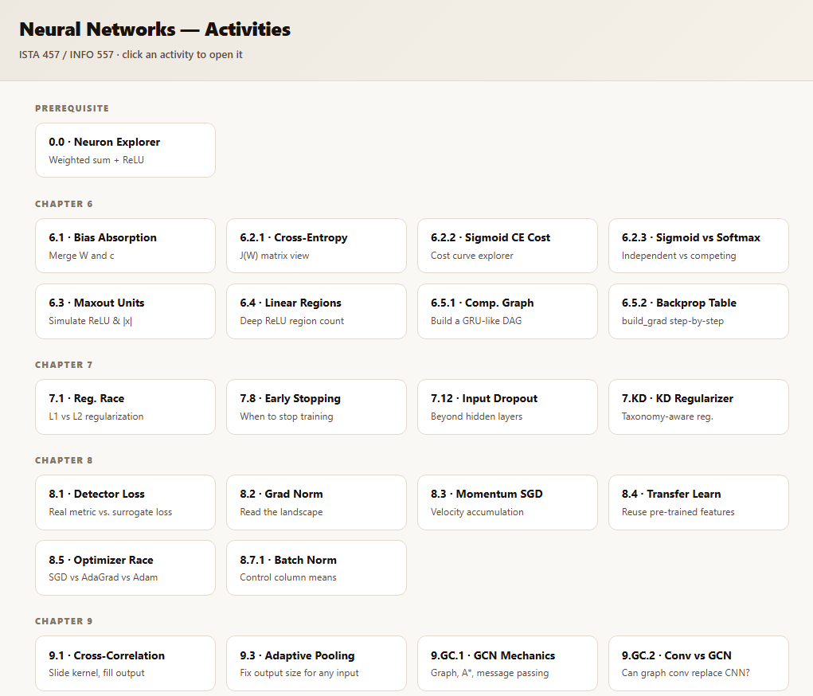

### Neuron Explorer

The Neuron Explorer helps students understand weighted sums, activations, and how inputs and weights affect output.

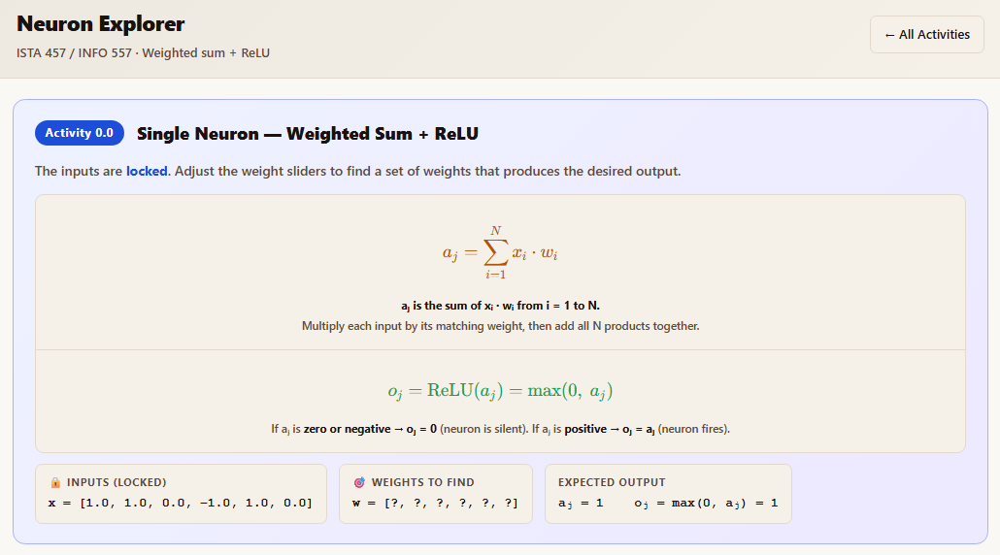

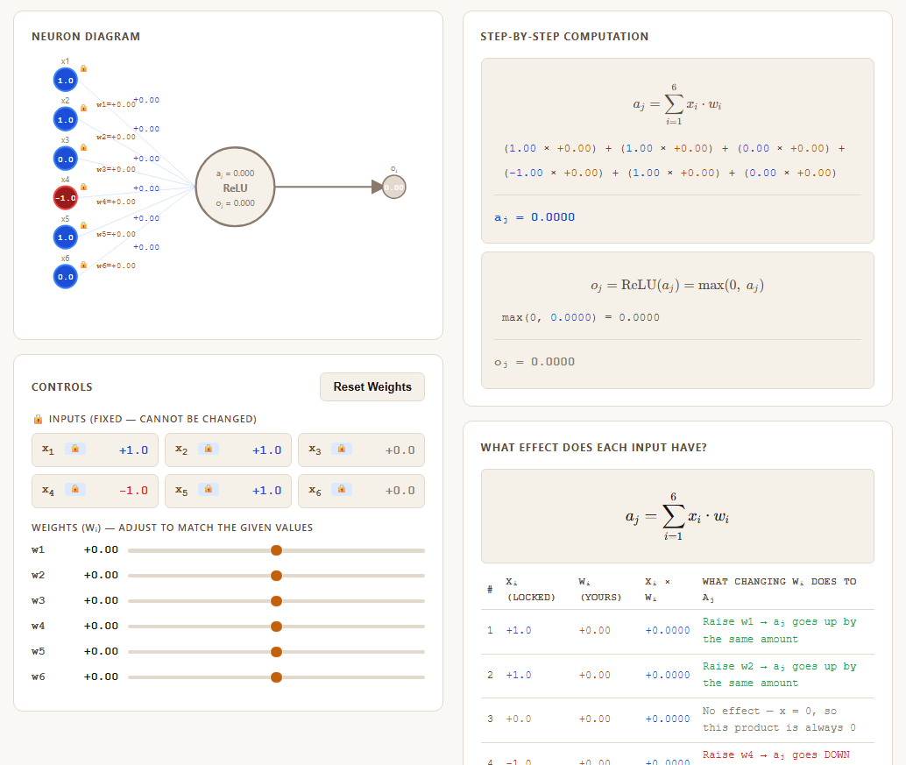

### Assignment Explorer

The assignment explorer connects the problem, dataset, approach, key concepts, training, evaluation, and code.

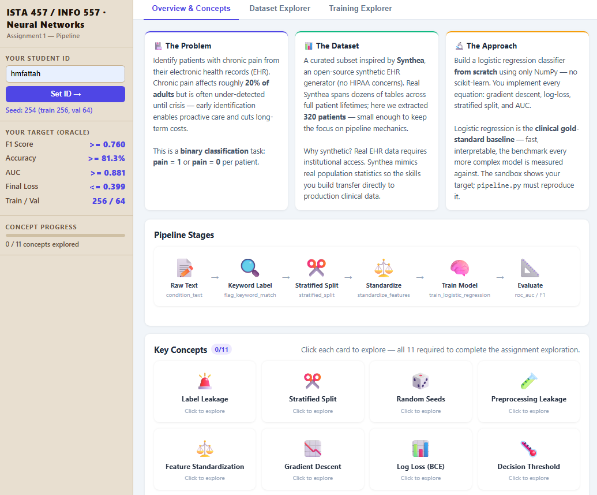

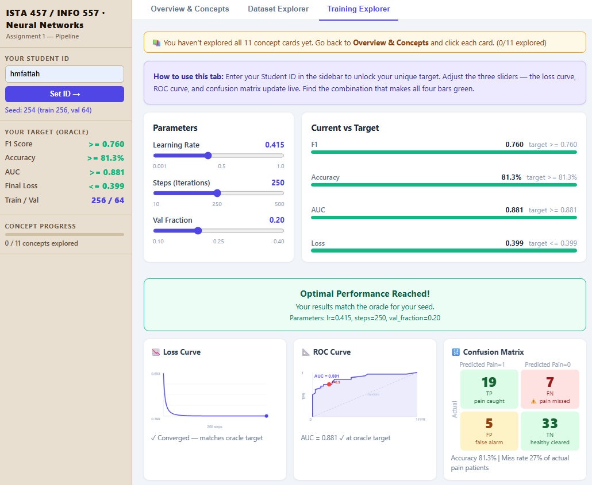

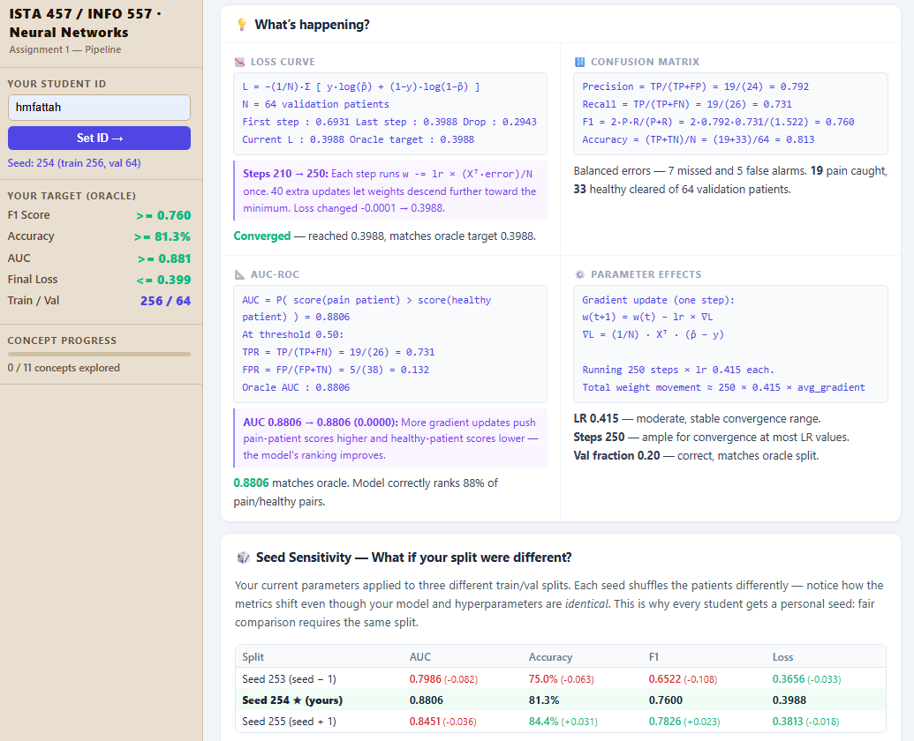

### Final Project Explorer

The final project explorer helps students move from a clinical AI question to model comparison, reproducibility, and project reflection.

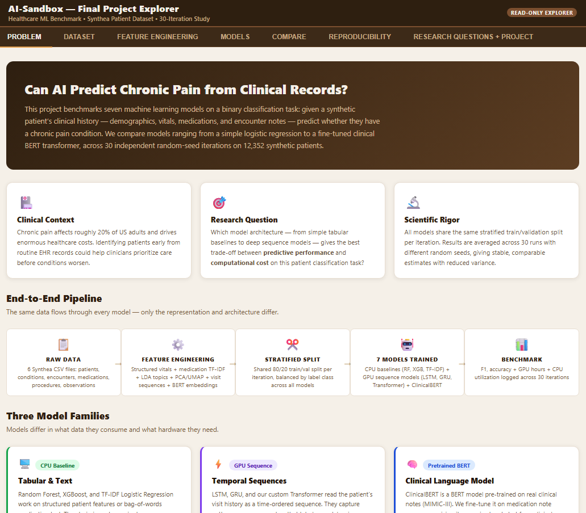

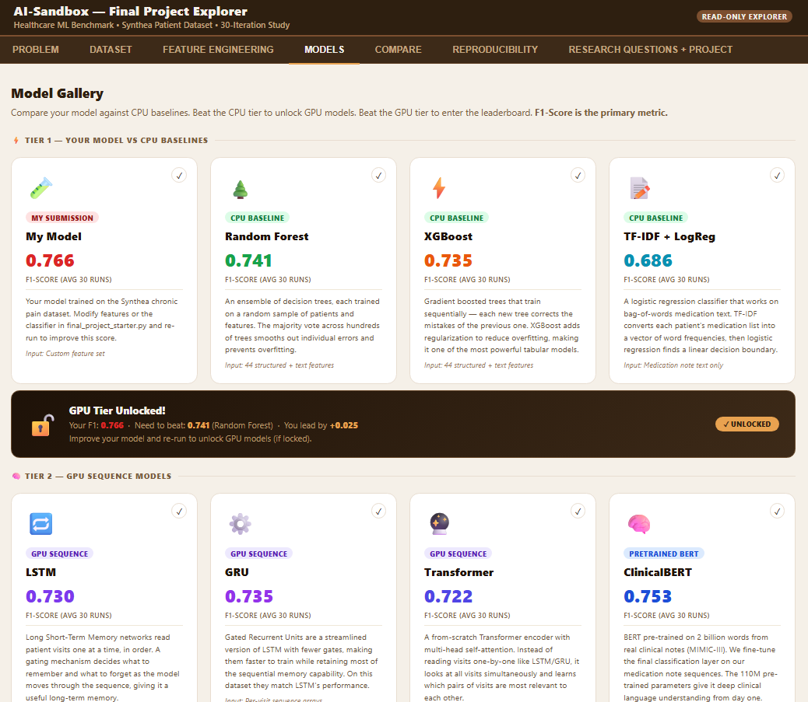

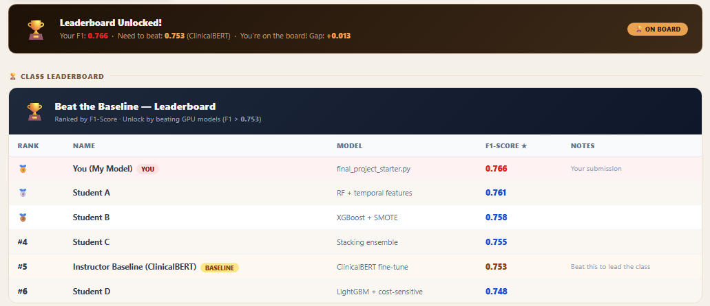

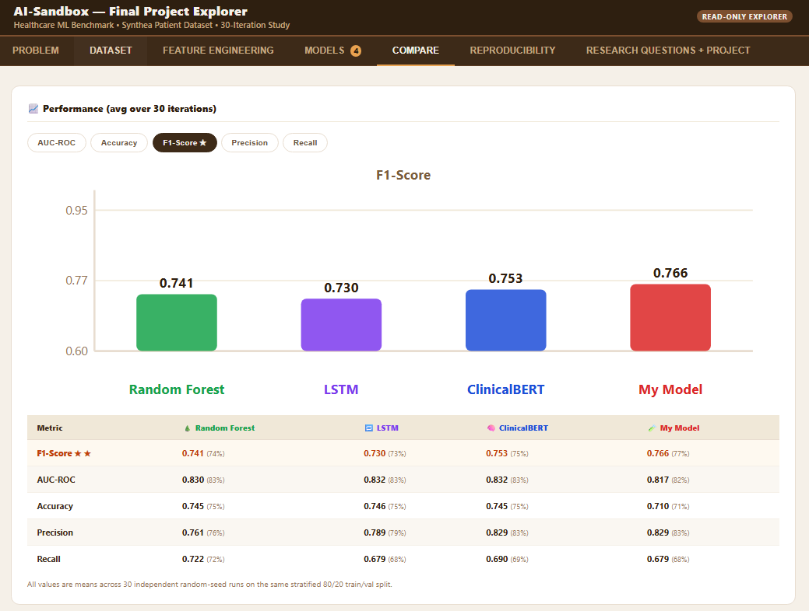

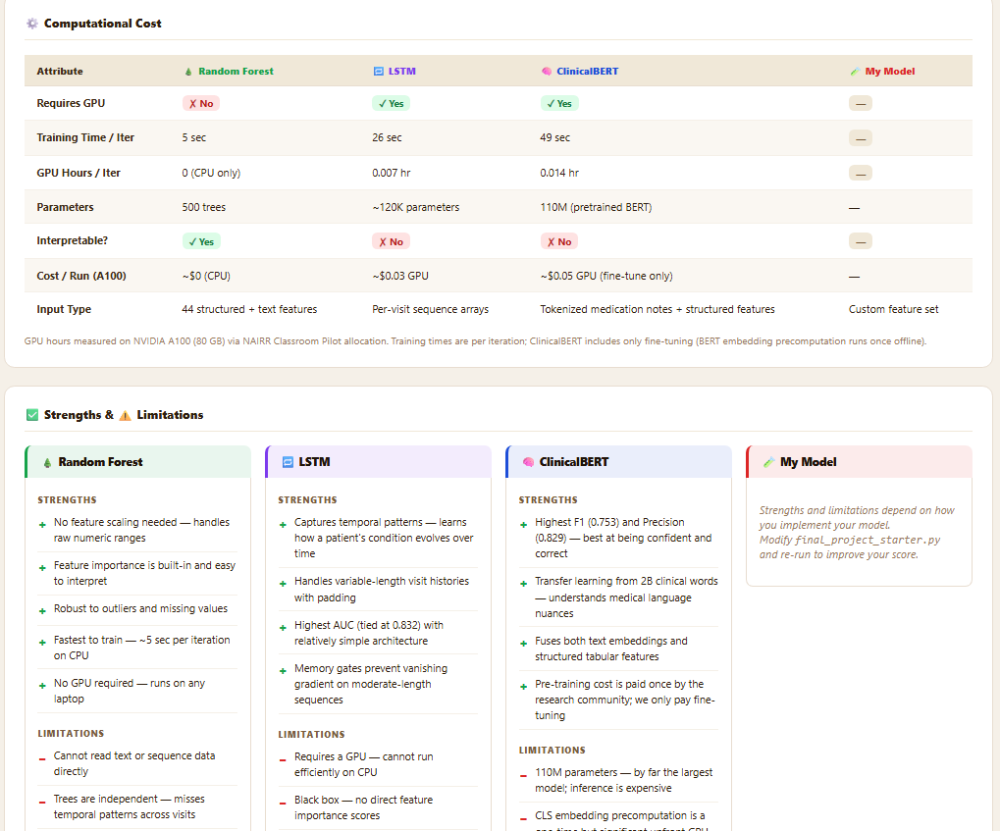

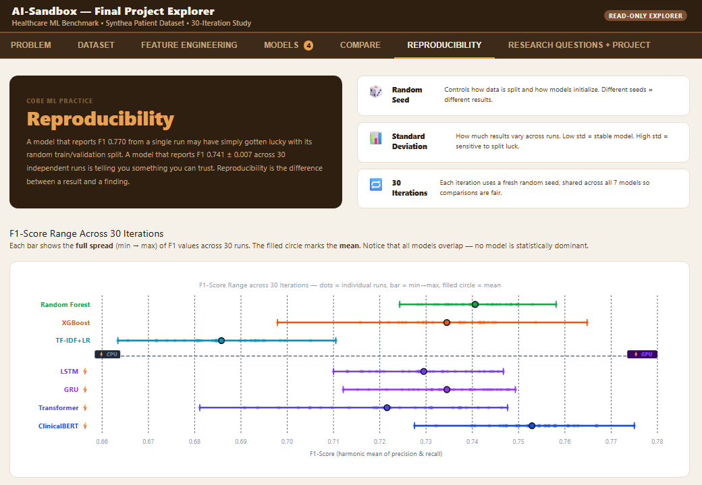

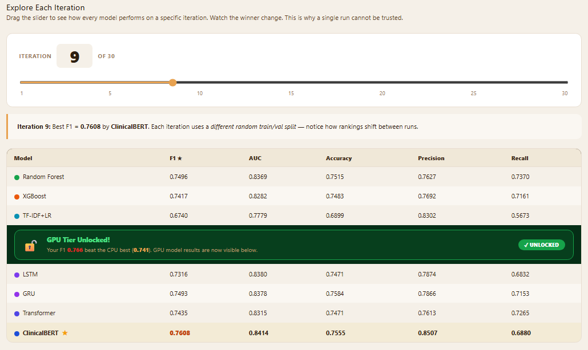

## Current Status

- Sandbox built and deployed.
- Workflow and classroom activities integrated in D2L.
- Two-section pilot underway in Neural Networks.
- Run logs, reflections, and pre-surveys are being collected.
- Comparison and analysis will happen after the semester.

## Future Directions

- Make the sandbox plug-and-play for instructors.
- Add open datasets, autograders, and rubrics.
- Embed compute, fairness, and data-use constraints into assignments.
- Expand across courses and institutions.
- Study whether sandbox-based learning changes student practice at a larger scale.

## Expected Outcome

By the end of the course, students should be able to use AI as an experimental process. They should be able to test ideas, compare results, explain variation, document experiments, reflect on errors, collaborate with peers, and justify model choices.

The AI Sandbox plan is designed to make neural network learning more hands-on, guided, reflective, and reproducible while keeping the classroom workflow simple and accessible.

## Contact

**H M Abdul Fattah**  
PhD student, College of Information  
University of Arizona  
hmfattah@arizona.edu

**Greg Chism**  
Assistant Professor of Practice, College of Information  
University of Arizona  
gchism@arizona.edu

**John Chen**  
Assistant Professor, College of Information  
University of Arizona  
johnchen@arizona.edu

## Acknowledgments

This project is connected to the NAIRR Classroom Pilot and the AI Sandbox classroom work at the University of Arizona. Computing support is planned through Jetstream2 and related research infrastructure.
